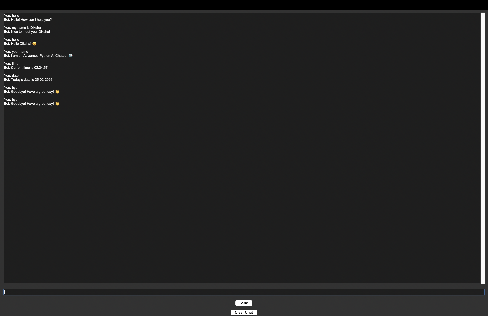

# AI Chatbot Project 🤖

## Features
- Greeting system
- Name memory
- Date and time response
- Math calculation
- GUI interface

## Technologies Used
- Python
- Tkinter

## How to Run
1. Install Python
2. Run: python chatbot.py
3. ## Project Screenshot

